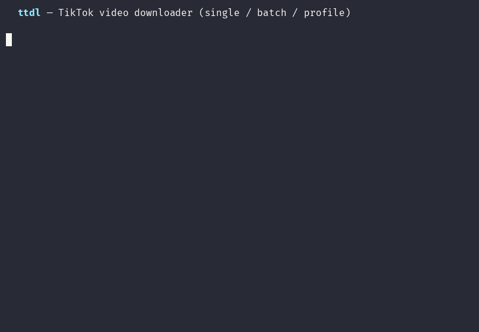

# ttigdl — TikTok & Instagram video downloader


A small, ergonomic command-line tool to download **TikTok and Instagram** videos — **single or batch** — built on top of [`yt-dlp`](https://github.com/yt-dlp/yt-dlp), the most reliable engine for both.

<p align="center">
  
</p>

## Contents

- [Why yt-dlp matters here](#why-yt-dlp-matters-here)
- [Install](#install)
- [Usage](#usage)
- [Tips](#tips)
- [Development](#development)
- [Contributing](#contributing)
- [Code of Conduct](#code-of-conduct)
- [Legal](#legal)
- [License](#license)

It wraps `yt-dlp` with sane defaults so you don't have to remember flags:

- ✅ **TikTok and Instagram** — videos, reels, posts, and whole profiles
- ✅ **Watermark-free** TikTok downloads (yt-dlp's default format)
- ✅ **Single, batch, or whole-profile** — pass URLs, a file, or a `@user` profile
- ✅ **QuickTime-compatible H.264** (`--h264`) — avoids VP9 that Apple players can't decode
- ✅ **Concurrent** downloads (`-j`)
- ✅ **Audio-only** extraction to MP3 (`-a`)
- ✅ **Resume archive** — skip videos you've already downloaded (`--archive`)
- ✅ Clean filenames grouped by uploader, optional metadata + thumbnails
- ✅ Cookies support for region-locked / private videos
- ✅ Clear per-URL success/failure summary

## Why yt-dlp matters here

TikTok and Instagram change their page structure often, which breaks older extractors. This tool **prefers a fresh `yt-dlp` from your active Python environment** and pulls in browser **impersonation** (`curl_cffi`) for reliability. An out-of-date `yt-dlp` will fail with *"Unable to extract webpage video data"* — keep it current (`pip install -U "yt-dlp[default]"`).

> **Instagram codec note:** some Instagram posts are served as high-res **VP9**, which QuickTime/Apple players can't decode (you'll get audio but no video). Add `--h264` to fetch a universally-playable H.264/AAC version instead.

## Install

### Option A — as a global command (recommended)

```bash
pipx install /Users/davidcjw/code/tt-ig-downloader
ttigdl --version
```

This gives you a global `ttigdl` command with its own up-to-date `yt-dlp[default]`.

### Option B — local virtualenv

```bash
cd tt-ig-downloader
python3 -m venv .venv
./.venv/bin/python -m pip install -r requirements.txt
./.venv/bin/python ttigdl.py --version
```

> `ffmpeg` is required only for `--audio` extraction (`brew install ffmpeg`).

## Usage

```text
ttigdl [URLS ...] [options]
```

### Examples

```bash
# Single TikTok video
ttigdl https://www.tiktok.com/@user/video/1234567890

# Instagram post or reel (add --h264 for QuickTime-friendly playback)
ttigdl https://www.instagram.com/p/SHORTCODE/ --h264
ttigdl https://www.instagram.com/reel/SHORTCODE/ --h264

# Several at once, into a folder, 4 at a time
ttigdl url1 url2 url3 -o ~/Videos -j 4

# Batch from a file (one URL per line, # comments allowed)
ttigdl -f urls.txt --archive --metadata

# A whole profile (downloads all of a user's videos)
ttigdl https://www.tiktok.com/@someuser
ttigdl https://www.instagram.com/someuser

# Extract audio as MP3 instead of video
ttigdl https://www.tiktok.com/@user/video/123 --audio

# Region-locked / private? Borrow cookies from your browser
ttigdl <url> --cookies-from-browser chrome
```

### Options

| Flag | Description |
|------|-------------|
| `urls...` | One or more TikTok / Instagram video / profile URLs |
| `-f, --file FILE` | Read URLs from a text file (one per line, `#` comments) |
| `-o, --output-dir DIR` | Where to save (default: `./downloads`) |
| `-j, --jobs N` | Concurrent downloads (default: `1` = live progress) |
| `-a, --audio` | Extract audio as MP3 instead of video |
| `--h264` | Prefer QuickTime/Apple-compatible H.264 video + AAC audio |
| `--archive [FILE]` | Record downloaded IDs and skip them next run (default `ttigdl-archive.txt`) |
| `--metadata` | Also write a `.info.json` sidecar per video |
| `--thumbnail` | Also download the cover thumbnail |
| `--force` | Re-download even if the file already exists |
| `--cookies-from-browser BROWSER` | Load cookies from `chrome`/`safari`/`firefox`/… |
| `--cookies FILE` | Load cookies from a Netscape `cookies.txt` file |
| `-t, --template TMPL` | Custom yt-dlp output filename template |
| `-X, --extra ARG` | Pass a raw yt-dlp argument through (repeatable) |
| `--allow-any` | Allow URLs from other sites (yt-dlp supports many) |
| `-s, --simulate` | Resolve/validate without downloading |
| `-q, --quiet` | Suppress yt-dlp output |

### Output layout

By default files are saved as `downloads/<uploader>/<video_id>.<ext>`, e.g.

```
downloads/
├── tiktok/
│   ├── 7651659857640033566.mp4
│   └── 7652870361331043614.mp4
└── instagram/
    └── C8xYz1AbCdE.mp4
```

Customize with `-t/--template` using any [yt-dlp output template](https://github.com/yt-dlp/yt-dlp#output-template).

## Tips

- **Profile download fails but single videos work?** Update yt-dlp — profile/user extraction is the first thing to break on old versions.
- **`jobs > 1`** runs quietly and prints a one-line status per URL; **`jobs == 1`** streams live yt-dlp progress.
- Re-running with the same `--archive` file is the safe way to "sync" a profile without re-downloading.

## Development

```bash
python3 -m venv .venv
./.venv/bin/python -m pip install -r requirements.txt pytest
./.venv/bin/python -m pytest tests/ -q
```

## Legal

Download only content you have the right to. Respect TikTok's and Instagram's Terms of Service and creators' copyright. This tool is for personal/archival use; you are responsible for how you use it.

## Contributing

Contributions are welcome! Please open an issue first to discuss what you'd like to change.

1. Fork the repo
2. Create a feature branch (`git checkout -b feature/your-feature`)
3. Commit your changes (`git commit -m 'feat: describe change'`)
4. Push and open a pull request

Please make sure the tests pass (`pytest tests/ -q`) before submitting a PR. When adding a flag, wire it into `build_parser()` → `build_base_command()` and add a matching test (see [AGENTS.md](AGENTS.md)).

## Code of Conduct

This project follows the [Contributor Covenant v2.1](https://www.contributor-covenant.org/version/2/1/code_of_conduct/).
By participating you agree to uphold a welcoming, harassment-free environment.

## License

Distributed under the MIT License. See [LICENSE](LICENSE) for details.
